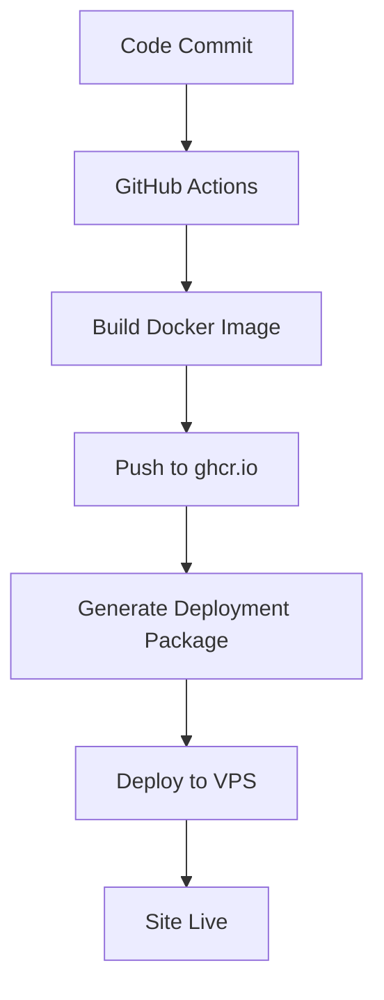

# ⚙️ Configuration GitHub Actions

## 🔑 Étapes de Configuration

### 1. Activer les Permissions

Dans votre repository GitHub → **Settings** → **Actions** → **General** :

**Workflow permissions** :
- ✅ Sélectionner **"Read and write permissions"**
- ✅ Cocher **"Allow GitHub Actions to create and approve pull requests"**

### 2. Configurer les Variables (Optionnel)

**Settings** → **Secrets and variables** → **Actions** → **Variables** :

| Variable | Valeur | Description |
|----------|--------|-------------|
| `NEXT_PUBLIC_SITE_URL` | `https://votre-domaine.com` | URL publique de votre site |

### 3. Vérifier les Secrets Automatiques

Ces secrets sont créés automatiquement par GitHub :
- ✅ `GITHUB_TOKEN` - Pour publier dans GitHub Container Registry
- ✅ `GITHUB_ACTOR` - Nom d'utilisateur GitHub

## 🚀 Test de la Configuration

### 1. Premier Commit

```bash
# Dans votre projet
git add .
git commit -m "Setup CI/CD with GitHub Actions"
git push origin main
```

### 2. Vérifier le Build

1. Aller dans **Actions** de votre repository
2. Voir le workflow **"Build and Push Docker Image"** se lancer
3. Attendre le statut ✅ vert

### 3. Vérifier l'Image

Votre image sera disponible à :
```
ghcr.io/abdelfattehsakkat/vitrine2:latest
```

### 4. Test de Déploiement

```bash
# Tester l'image générée
docker pull ghcr.io/abdelfattehsakkat/vitrine2:latest
docker run -p 3000:3000 ghcr.io/abdelfattehsakkat/vitrine2:latest
```

## 📦 GitHub Container Registry

### Visibilité du Package

Par défaut, le package est **privé**. Pour le rendre public :

1. Aller sur https://github.com/users/abdelfattehsakkat/packages
2. Cliquer sur votre package `vitrine2`
3. **Package settings** → **Change visibility** → **Public**

### Authentification Docker

Pour pull des images privées :

```bash
# Créer un token GitHub (si nécessaire)
echo "YOUR_GITHUB_TOKEN" | docker login ghcr.io -u abdelfattehsakkat --password-stdin
```

## 🔄 Workflow des Déploiements



## 🛠️ Débogage

### Build qui échoue ?

1. **Vérifier les logs** dans l'onglet Actions
2. **Problèmes courants** :
   - Erreur TypeScript → Corriger dans le code
   - Manque de permissions → Vérifier les settings
   - Problème Docker → Tester le build local

### Image non créée ?

1. **Vérifier les permissions** Actions
2. **Regarder les logs** du workflow
3. **Tester en local** :
   ```bash
   docker build -t test-image .
   ```

### Déploiement qui échoue ?

1. **Vérifier l'accès** au registry :
   ```bash
   docker pull ghcr.io/abdelfattehsakkat/vitrine2:latest
   ```
2. **Logs du container** :
   ```bash
   docker logs dental-clinic-app
   ```

## 📋 Checklist de Configuration

- [ ] ✅ Permissions Actions configurées
- [ ] ✅ Premier commit poussé
- [ ] ✅ Workflow "Build and Push" réussi  
- [ ] ✅ Image disponible dans ghcr.io
- [ ] ✅ Test de déploiement local réussi
- [ ] ✅ Package rendu public (optionnel)

## 🎯 Résultat Final

Après configuration, **à chaque commit** :

1. 🔨 **Build automatique** de l'image Docker
2. 📦 **Push** vers GitHub Container Registry
3. 🏷️ **Tag** avec la version/commit
4. 📋 **Artefacts** de déploiement générés
5. 🚀 **Prêt** pour déploiement instantané

---

**🎉 Votre pipeline CI/CD est configuré ! Chaque commit génère une nouvelle image Docker prête à déployer !**